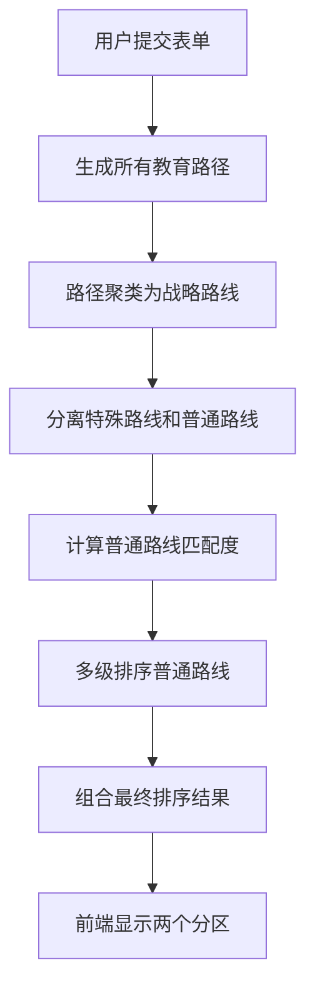
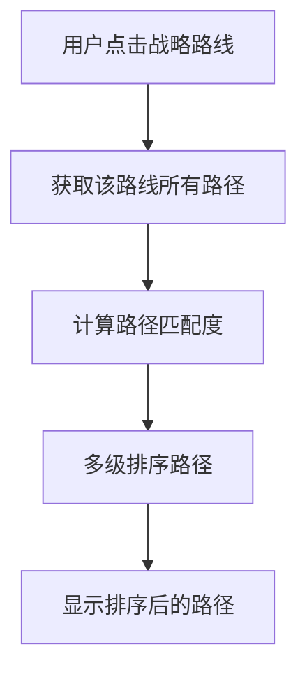

# 教育路径排序逻辑说明

## 📋 概述

本文档详细说明了教育路径规划系统中路径排序的实现逻辑，包括战略路线排序和路径内部排序两个层面。

## 🎯 排序目标

### 战略路线排序
- 基于用户当前教育状态，优先推荐最匹配的战略路线
- 确保"其他个性化路线"排在可行路线的最后
- 确保"不可行路线"独立显示在最后

### 路径内部排序
- 在选定战略路线后，对该路线内的所有路径进行智能排序
- 优先显示与用户当前教育水平最匹配的路径

## 🔄 排序流程

### 1. 战略路线排序流程



### 2. 路径内部排序流程



## 📊 排序算法详解

### 战略路线排序算法

#### 1. 路线分类
```javascript
// 分离特殊路线和普通路线
const specialRoutes = routes.filter(route => 
  route.id === 'other_paths' || route.id === 'infeasible_paths'
);
const normalRoutes = routes.filter(route => 
  route.id !== 'other_paths' && route.id !== 'infeasible_paths'
);
```

#### 2. 匹配度计算
```javascript
// 计算战略路线的平均匹配得分
const normalRoutesWithMatchScore = normalRoutes.map(route => ({
  ...route,
  averageMatchScore: this.matchScoreCalculator.calculateRouteAverageMatchScore(
    route.paths, 
    userInput.currentLevel
  )
}));
```

#### 3. 多级排序
```javascript
const sortedNormalRoutes = normalRoutesWithMatchScore.sort((a, b) => {
  // 1. 优先按平均匹配得分排序（匹配度高的在前）
  if (a.averageMatchScore !== b.averageMatchScore) {
    return b.averageMatchScore - a.averageMatchScore;
  }
  // 2. 其次按可行性评分排序
  if (a.feasibilityScore !== b.feasibilityScore) {
    return b.feasibilityScore - a.feasibilityScore;
  }
  // 3. 最后按路径数量排序
  return b.pathCount - a.pathCount;
});
```

#### 4. 最终组合
```javascript
// 最终排序：普通路线 + 其他个性化路线 + 不可行路线
const finalRoutes = [...sortedNormalRoutes];

if (otherPathsRoute) {
  finalRoutes.push(otherPathsRoute);
}

if (infeasiblePathsRoute) {
  finalRoutes.push(infeasiblePathsRoute);
}
```

### 路径内部排序算法

#### 1. 匹配度计算
```javascript
// 计算单条路径的匹配得分
calculatePathMatchScore(path, currentLevel) {
  if (path.nodes.length === 0) {
    return 0;
  }

  let totalSim = 0;
  
  // 计算路径中每个阶段水平与当前水平的相似度
  for (const node of path.nodes) {
    const level = node.level as EducationLevel;
    const sim = this.calculateLevelSimilarity(level, currentLevel);
    totalSim += sim;
  }
  
  return totalSim / path.nodes.length;
}
```

#### 2. 水平相似度计算
```javascript
calculateLevelSimilarity(level1, level2) {
  // 如果两个水平相同，相似度为1.0
  if (level1 === level2) {
    return 1.0;
  }

  // 判断是否为国际体系
  const level1IsInternational = this.isInternationalLevel(level1);
  const level2IsInternational = this.isInternationalLevel(level2);

  // 如果都是国际体系或都是国内体系，相似度为0.5
  if (level1IsInternational === level2IsInternational) {
    return 0.5;
  }

  // 如果一个是国际体系，一个是国内体系，相似度为0.0
  return 0.0;
}
```

#### 3. 多级排序
```javascript
return rankedPaths.sort((a, b) => {
  // 1. 首先按匹配度排序（降序）
  const matchScoreA = this.matchScoreCalculator.calculatePathMatchScore(a, currentLevel);
  const matchScoreB = this.matchScoreCalculator.calculatePathMatchScore(b, currentLevel);
  
  if (matchScoreA !== matchScoreB) {
    return matchScoreB - matchScoreA; // 降序
  }
  
  // 2. 匹配度相同时，按常见度排序（降序）
  const prevalenceA = this.calculatePrevalenceScore(a);
  const prevalenceB = this.calculatePrevalenceScore(b);
  
  if (prevalenceA !== prevalenceB) {
    return prevalenceB - prevalenceA; // 降序
  }
  
  // 3. 常见度也相同时，按总费用排序（升序，费用低的在前）
  const costA = a.costBreakdown?.total || 0;
  const costB = b.costBreakdown?.total || 0;
  
  return costA - costB; // 升序
});
```

## 🏷️ 教育水平分类

### 国际体系水平
```javascript
const internationalLevels = new Set([
  '民办双语',
  '外籍人员子女学校',
  '公立国际部',
  '民办国际化学校',
  '海外高中',
  '海外大学',
  '海外硕士',
  '海外博士'
]);
```

### 国内体系水平
```javascript
const domesticLevels = new Set([
  '公立',
  '普通私立',
  '民办普通高中',
  '职业高中',
  '国内公办',
  '国内民办',
  '中外合作办学',
  '国内硕士',
  '国内博士'
]);
```

## 📈 排序权重配置

### 战略路线排序权重
- **匹配度权重**: 100% (主要排序依据)
- **可行性评分**: 次要排序依据
- **路径数量**: 最后排序依据

### 路径内部排序权重
- **匹配度**: 100% (主要排序依据)
- **常见度**: 次要排序依据
- **费用**: 最后排序依据

## 🎨 前端显示逻辑

### 战略路线显示
```javascript
// 分离路线：第一个分区包含所有可行路线（包括其他个性化路线），第二个分区只包含不可行路线
const feasibleRoutes = this.strategicRoutes.filter(route => route.id !== 'infeasible_paths');
const infeasibleRoutes = this.strategicRoutes.filter(route => route.id === 'infeasible_paths');
```

### 路径详情显示
```javascript
// 直接使用战略路线中的路径，不进行匹配
const routePaths = route.paths;

// 基于当前教育状态对路径进行重新排序
const currentLevel = this.getCurrentLevel();
const sortedRoutePaths = this.pathRanker.rankPathsByCurrentState(routePaths, currentLevel);
```

## 🔧 技术实现

### 后端服务
- **MatchScoreCalculatorService**: 计算匹配度
- **PathClustererService**: 路径聚类和战略路线排序
- **PathRankerService**: 路径内部排序

### 前端服务
- **MatchScoreCalculatorService**: 前端匹配度计算
- **PathClustererService**: 前端路径聚类
- **PathRankerService**: 前端路径排序

### 关键方法
```javascript
// 战略路线排序
clusterPaths(paths, userInput)

// 路径内部排序
rankPathsByCurrentState(paths, currentLevel)

// 匹配度计算
calculatePathMatchScore(path, currentLevel)
calculateRouteAverageMatchScore(paths, currentLevel)
```

## 📝 排序示例

### 示例1：用户当前状态为"小学-公立-4年级"，目标"研究生"

**战略路线排序结果**：
1. 国内直达路线 (匹配度: 1.0)
2. 海外直通路线 (匹配度: 0.5)
3. 其他个性化路线 (固定最后)
4. 不可行路线 (独立分区)

**国内直达路线内部路径排序**：
1. 公立 → 公立 → 国内公办 → 国内硕士 (匹配度: 1.0, 费用: 80万)
2. 公立 → 公立 → 国内民办 → 国内硕士 (匹配度: 1.0, 费用: 120万)
3. 公立 → 普通私立 → 国内公办 → 国内硕士 (匹配度: 0.5, 费用: 100万)

### 示例2：用户当前状态为"高中-民办国际化学校-2年级"，目标"研究生"

**战略路线排序结果**：
1. 海外直通路线 (匹配度: 1.0)
2. 国内直达路线 (匹配度: 0.5)
3. 其他个性化路线 (固定最后)
4. 不可行路线 (独立分区)

**海外直通路线内部路径排序**：
1. 民办国际化学校 → 海外大学 → 海外硕士 (匹配度: 1.0, 费用: 250万)
2. 民办国际化学校 → 海外大学 → 国内硕士 (匹配度: 0.5, 费用: 200万)

## 🚀 性能优化

### 缓存机制
- 匹配度计算结果缓存
- 路径聚类结果缓存
- 排序结果缓存

### 算法优化
- 使用Set数据结构提高查找效率
- 避免重复计算匹配度
- 优化排序算法复杂度

## 🔍 调试和测试

### 调试工具
- 控制台日志输出
- 路径数据调试页面 (`debug-path-data.html`)
- 排序逻辑测试页面 (`test-path-sorting.html`)

### 测试用例
- 不同教育状态的排序测试
- 边界条件测试
- 性能压力测试

## 📚 相关文档

- [标签系统说明.md](./标签系统说明.md)
- [战略路线映射关系.md](./战略路线映射关系.md)
- [今日工作成果总结.md](./今日工作成果总结.md)

## 🔄 更新历史

- **2025-09-13**: 初始版本，实现基础排序逻辑
- **2025-09-13**: 添加路径内部排序功能
- **2025-09-13**: 优化匹配度计算算法
- **2025-09-13**: 完善前端显示逻辑

---

*本文档随系统功能更新而持续维护*
